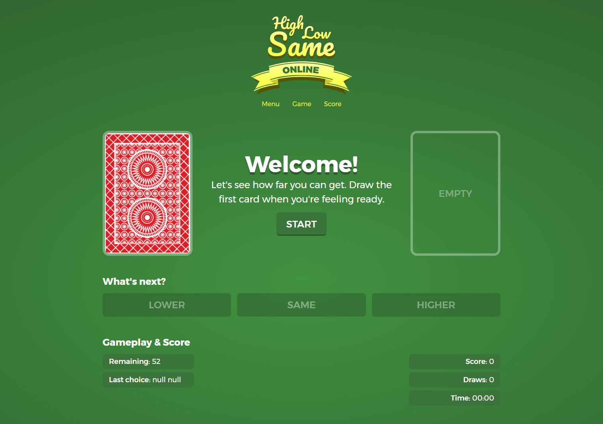

# High, Low, Same

High, Low, Same is a web-based card guessing game.



## Requirements

For running the game, you'll need:

* PHP 7.1.3 or higher
* Composer
* SQLite3 and PDO_SQLite PHP extension
* [Symfony Requirements](https://symfony.com/doc/current/reference/requirements.html)

If you want to develop and contribute to the game, you'll also need:

* NodeJS 8.9.0 or higher
* NPM 5.5.1 or higher / Yarn 1.5.1 or higher

## Installation

Clone the project to your computer:

```bash
$ git clone https://github.com/lorceroth/high-low-same.git
```

## Usage

The following command will run the game at http://localhost:8000

```bash
$ php bin/console server:run
```

## Testing

To run the tests:

```bash
$ php bin/phpunit
```
